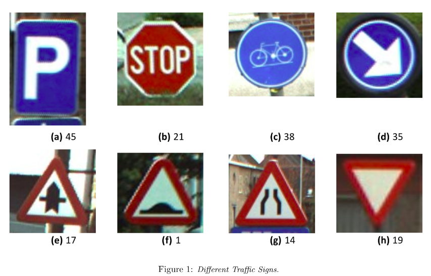
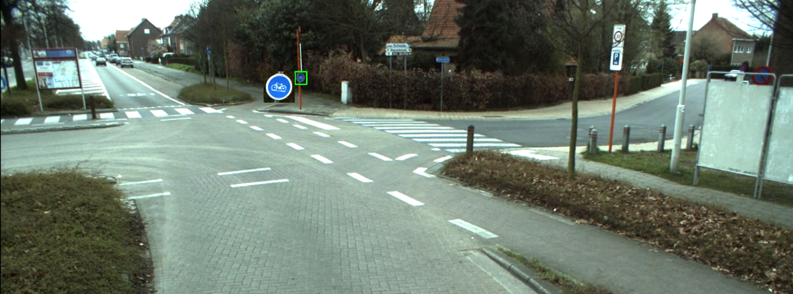
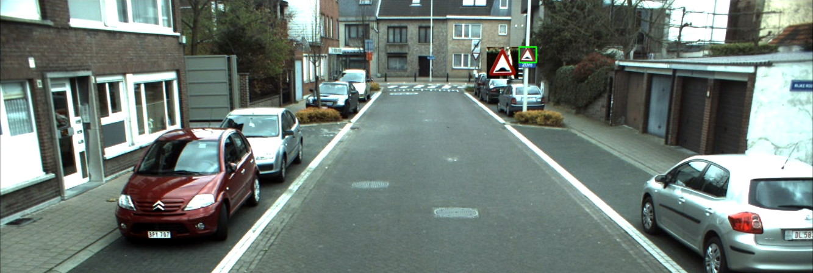
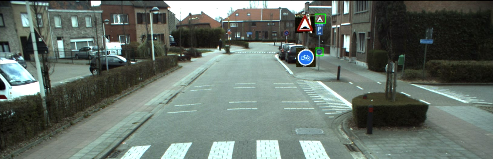
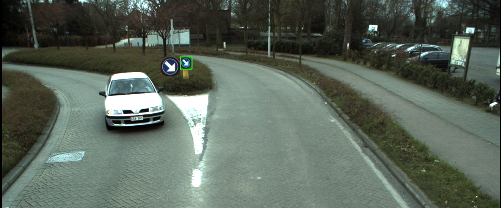
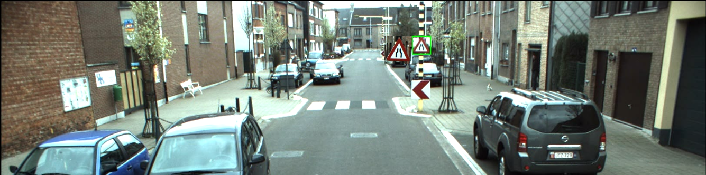
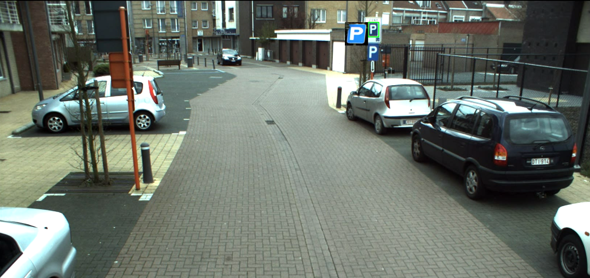
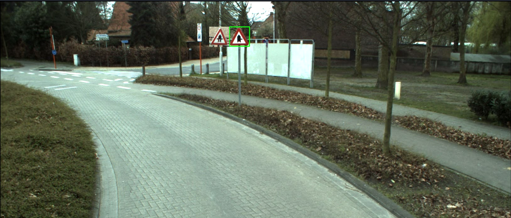
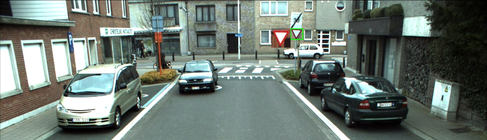
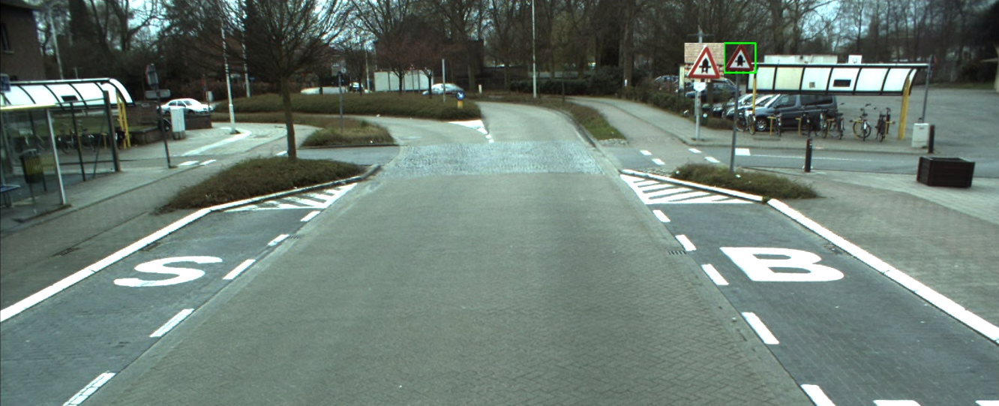

# Traffic-sign-recognition

## Table of contents
* [Overview](#Overview)
* [Dataset](#Dataset)
* [Output Video](#Output Video)
* [Libraries used](#Libraries used)

## Overview

Traffic Sign Recognition can be staged into two sections: Traffic Sign Detection and Traffic Sign Classification. In the Detection stage we aim to extract possible candidates (or regions) which contain a traffic sign (in this part, we do not care what the sign might be). In the Classification stage, we go over each Region of Interest (RoI) extracted previously and try to identify a traffic sign (which might not be in that RoI at all). The dataset.

The repository contains following files and folders:

- traffic_sign_recognition.pdf - Project report with detials.
- Final_TSR_detect.py - python code for running the traffic sign recognition algorithm
- dataset.pkl - pickle file containing the trained model using SVM
- templates - consists of different signs as templates, to be used for classification.

## Dataset
For the dataset, images from a driving car, training and testing images for a set of signs can be found [here](https://drive.google.com/drive/u/0/folders/0B8DbLKogb5ktTW5UeWd1ZUxibDA).

## Output Video:

The google drive link for sample output video is provided here:

[Video](https://drive.google.com/open?id=1EfDC4rpTF3HhwQKok_FVIE2kgiWOaShD)

## Libraries used:
Project is created with:
* OpenCV 4
* Numpy
* Scikit Learn
* pickle
* Skimage

# Theory

Introduction In this project of Traffic Sign Recognition, the whole project can be divided into two phases. First phase involved the detection of the sign, (this phase does not focus on what the sign is). The next phase of Classification involved determining the sign that was been detected. For the detection phase, we first denoise the image, followed by contrast stretching and normalizing the intensity. After this we applied the MSER algorithm for feature detection. Once these features were identified, a bounding box is fitted to the detected Region of Interest for the data preparation of the next phase of Classification. In Classification, first the SVM(Support Vector Machine) classifier is trained using HOG feature extraction on the training set. Then the corresponding detected areas of interest are classified using the trained SVM classifier.

## Detection Phase

1. The initial step involved denoising of the raw images. With this, averaging any nuances such as textures are removed for proper sign detection.
2. After this, we performed contrast stretching on each channel i.e. on B,G and R channel. In contrast stretching higher and lower values of the pixel intensities are distributed between 0 and 255. The formula below is used for contrast stretching, where a = 0, b = 255 and c and d are the minimum and maximum intensities in the frame.
3. Normalization of these intensities was our next step. The above two steps distribute the pixel intensities and normalize it for significant improvement in easier detection of the blue and red color. For the Blue and red channel.
4. The next step involved the extraction of MSER features from the image. We constructed separate MSER functions for detecting the red and blue signs and their respective parameters were tuned accordingly.
5. The last step of detection phase was fitting a bounding box to the MSER features that were detected. The bounding box was also fine tuned as there were multiple boxes being formed.
6. The tuning was done by grouping different contours by their centroids. The centroids near each other are grouped together, say lies in a circle of radius 100 are grouped together. Groups with less than 4 contours are ignored as they are not important.
7. After grouping, the bounding box with maximum area is taken from each group. At this point we further increased the size of the bounding box, so that the image which was cropped out for classification gave us better results.

## Classification

1. Classification for blue and red coloured signals were done separately (just like the MSER features were applied and tuned individually due to their different intensities), i.e., they were trained and tested separately so that there are no kind of false identification because generally red coloured signs call for immediate action unlike the blue coloured ones.
2. Training folders are segregated based on the signs we need to perform the training. For training the SVM model for red coloured signals the training set was of 5 folders 1, 14, 17, 19 and 21.
3. Similarly, for the blue coloured signs 35, 38 and 45 were the folders. The training set consisted of the image and the corresponding label of the signal.
4. After this each image from each folders were resized to 16x16 and converted to grayscale and hog features were extracted.
5. After performing the training on the SVM model, for testing purpose the images from the test dataset were taken and checked using predict function.
6. After performing the evaluation over all the required test dataset we achieved an accuracy of 91.5%.
7. After this we need to apply the test part of the code to the main program where we give the detected sign as the test image and the predict function provides a label for each image and the corresponding sign is displayed beside the detected region.

## Images

||
|:--:|
| *Traffic signs to detect* |

||
|:--:|
| *Bicycle* |

||
|:--:|
| *Bump sign* |

||
|:--:|
| *Bump and Bicycle* |

||
|:--:|
| *Keep Right* |

||
|:--:|
| *Narrow Road* |

||
|:--:|
| *Parking Sign* |

||
|:--:|
| *Road on right* |

||
|:--:|
| *Yield sign* |

||
|:--:|
| *Cross road* |
